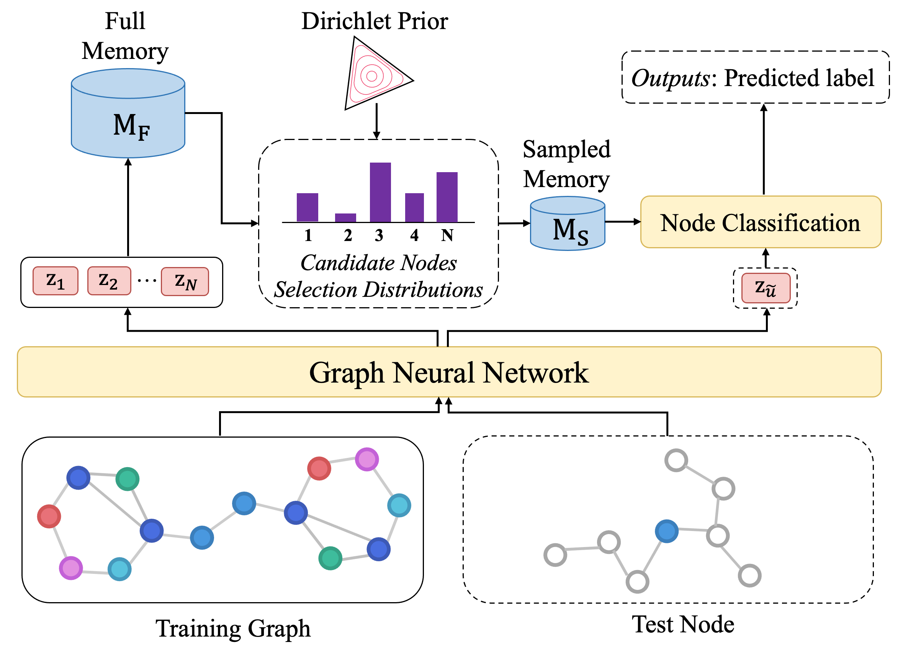

## Enhancing Graph Neural Networks via Memorized Global Information

This repository contains the PyTorch implementation for our MGIGNN. Further details about MGIGNN can be found in our paper.

## Abstract

Most Graph neural networks (GNNs) merely leverage information in a limited range of local neighbors, which is not able to capture long-range dependencies or global information in the graph. However, extending information to the whole graph provides GNNs with more information from similar nodes in large scale neighbors, which enables GNNs to learn more informative node representations. To this end, we propose MGIGNN (Memorized Global Information Graph Neural Network), an approach that leverages global information from global similar nodes to enhance GNNs. Unfortunately, finding global similar nodes requires calculating representations of all nodes in the graph using GNNs, which is computationally expensive. To circumvent the heavy burden of computing all node representations, MGIGNN uses an external memory module to store node representations and utilizes those representations from memory to efficiently find global similar nodes. Moreover, to efficiently make predictions at test time, MGIGNN retrieves global similar nodes from a set of candidate nodes, which are selected from a sparse node selection distribution with Dirichlet prior. Experimental results on seven real-world datasets show that our MGIGNN can improve the effectiveness of existing GNNs on node classification task under both inductive and transductive settings.

## Model Framework Overview

<p align="center">
  
</p>


## Installation

```shell
pip install -r requirements.txt
```

## Implement Details

MGIGNN can be equipped with various GNN models, now MGIGNN supports the following GNN models:

- GCN
- GraphSAGE
- GAT
- SGC
- DNA
- GCNII
- FILM
- SSGC
- FAGCN
- GATv2Conv

In the future, we aim at enabling MGIGNN to support more GNN models.

## Data Download

Please first download the dataset and unzip it into `data` directory.

Google Drive Link: https://drive.google.com/file/d/1Js_RMDL82sU-kj2AIa9Lvn4lFWUaQb9K/view?usp=sharing

## MGIGNN Training 

```python
python train.py --cuda_id 0 --model [gcn/graphsage/gat/sgc/dna/gcnii/film/ssgc/fagcn/gat2conv] --hidden_dim 64 --eta 1 --log_dir ./log/ --k 3 --epochs 50 --dataset ppi --normalize True --criterion sigmoid --run_times 5
```

## MGIGNN Prediction

```python
python predict.py --cuda_id 0 --model_path your_trained_mgignn_path --hidden_dim 64 --eta 1 --k 3 --dataset ppi --criterion 
```

